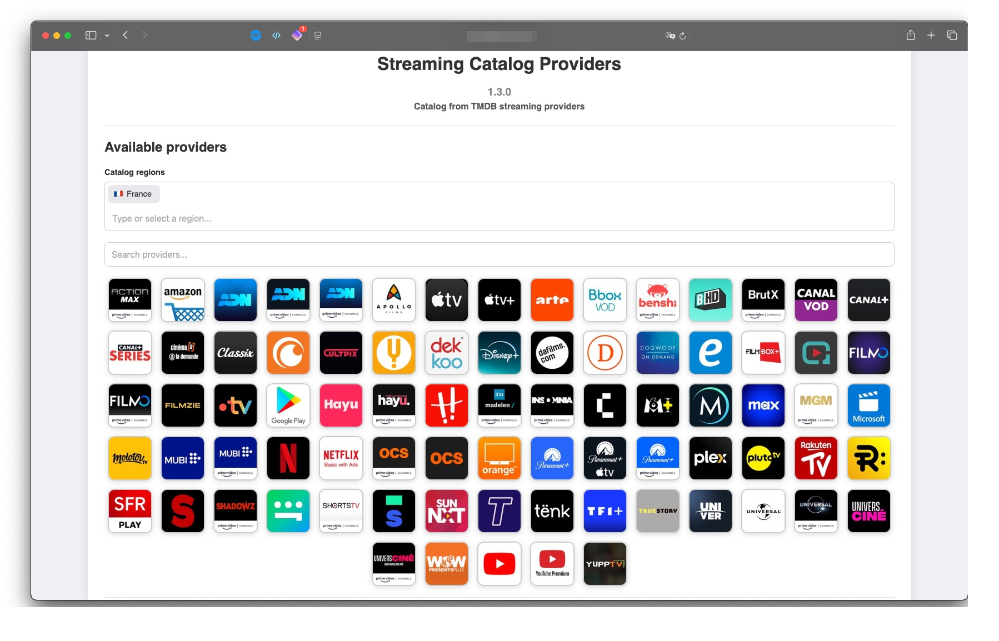

# Stremio Catalog Providers

## Description

Stremio Catalog Providers is an addon optimized for French content, designed to enhance the Stremio user experience by adding new catalogs. This addon uses The Movie Database (TMDB) as its main source of information, while integrating APIs from Rating Poster Database (RPDB) and FanArt to improve visual presentation and metadata.

!!! info "Active Development"
    This addon is actively developed by a French developer, ensuring special attention to the needs of the French-speaking community.

## Key Features

### Dynamic Streaming Platform Management

- Manages over 600 streaming platforms
- Adapts to user configurations via the addon's settings page

### Movie and Series Catalogs

- Offers catalogs of popular and recent content
- Displays titles and posters in the user's configured language

### Region-Specific Content

- Aggregates region-specific content (e.g., Netflix FR, Netflix US) into a unified catalog
- Ensures access to localized content for users

### Age-Based Filtering (Kids Catalog)

- Filters content based on age ranges using US certifications
- Excludes inappropriate genres
- Detailed guidelines are accessible via the "?" icon in the settings

### Advanced Catalog Filtering

- Allows filtering catalogs by genre, rating, and release year

### Customizable Catalog Display

- Allows organizing the display order of catalogs via the addon's configuration page

### Recommendations and Similar Titles

- Displays recommended and similar content directly on the content's page

### Trakt Integration

- Synchronizes Trakt watch history with Stremio
- Marks watched items in catalogs with a customizable emoji
- Automatic daily synchronization (customizable interval)
- Automatic token refresh to avoid re-authentication
- Allows manually marking content as watched on Trakt from Stremio

### RPDB Integration

- Provides movie and series posters with their ratings

### FanArt Integration

- Replaces titles with logos in the selected language (or English by default)

### Progressive Scraping

- Preloads upcoming content pages while scrolling to improve loading times

### Customizable Cache Management

- Catalog cache duration adjustable via an environment variable
- Customizable RPDB poster caching to reduce API load

## Data Source

All catalog data comes from TMDB, in compliance with their Terms of Service. This product uses the TMDB API but is not endorsed or certified by TMDB.

## Acknowledgements

A big thank you to the French developer of Stremio Catalog Providers for their hard work and dedication to improving the Stremio experience for both the French-speaking and international community. Your contribution is greatly appreciated!