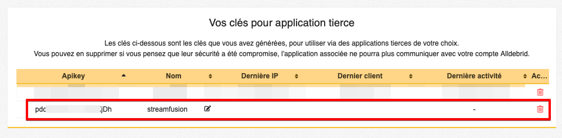

# Creating an AllDebrid API Key
This guide will help you create an AllDebrid API key specifically for your StreamFusion installation. This key will allow StreamFusion to securely interact with your AllDebrid account.

## Prerequisites

- An active AllDebrid account
- Access to a web browser

!!! note "Importance of the API Key"
    A dedicated API key for StreamFusion allows you to control and revoke access independently of your other applications, thus improving the security of your AllDebrid account.

## Steps to Create the API Key
Follow these steps to generate your AllDebrid API key for StreamFusion:

### 1. Log in to your AllDebrid account

1. Open your browser and go to the [official AllDebrid website](https://alldebrid.com/).

2. Click on "Login" at the top right of the page.

3. Enter your credentials and log in to your account.

    !!! tip "Account Security"
        Make sure to use a strong and unique password for your AllDebrid account. Enable two-factor authentication if available.

### 2. Generate the API key
1. In the APIKEYS section at the very top:

    

2. In the "Create an API key" section, fill out the form with `streamfusion`

    

!!! warning "API key name"
    On AllDebrid, API key names are important. For StreamFusion to function properly, it is mandatory to name the key `streamfusion`.

### 3. Integration with StreamFusion
If you have followed the previous steps correctly, you now have a new AllDebrid API key named `streamfusion`. You can now integrate it into your StreamFusion installation.

1. Open the `.env` file of your StreamFusion installation.

2. Find the line `AD_TOKEN=` and paste your new API key right after the equal sign.

3. Save the `.env` file.

!!! success "Configuration complete"
    Your AllDebrid API key is now properly configured to be used with StreamFusion!