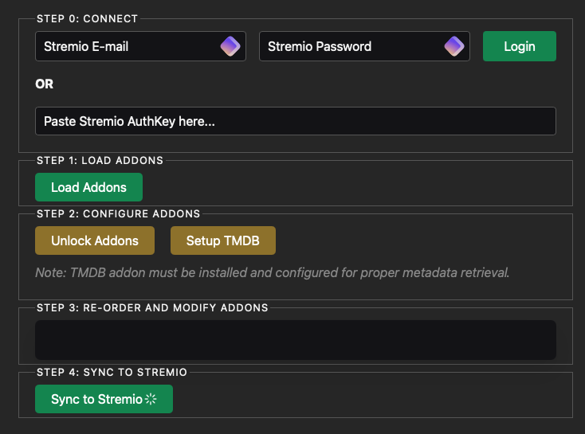

# Stremio Addon Manager



## Description

Stremio Addon Manager is a powerful tool designed to enhance your Stremio experience by offering advanced management capabilities for your add-ons. This manager allows you to reorganize, delete, and unlock the deletion of addons from a Stremio account. It also offers the ability to rename catalogs and edit addon manifests.

!!! info "Key Feature"
    One of the main features of this tool is its ability to remove Cinemata, which is normally impossible to delete in the base Stremio installation. This allows you to replace it with the official TMDB addon, which will then handle providing metadata.

!!! tip "Tip"
    With this addon, you can set all metadata to your preferred language, significantly improving the localization of your Stremio experience.

## Installation Guide

The installation process for the Stremio Addon Manager is simple. Follow these steps to set it up:

### 1. Create the Installation Directory

First, create a new directory for the Stremio Addon Manager:

```bash
mkdir stremio-addon-manager
cd stremio-addon-manager
```

### 2. Create the Docker Compose File

In the newly created directory, create a file named `docker-compose.yml` and add the following content:

```yaml
---
networks:
  proxy_network:
    external: true

services:
  stremio-addon-manager:
    image: ghcr.io/limedrive/stremio-addon-manager:latest
    container_name: stremio-addon-manager
    expose:
      - 80
    restart: unless-stopped
    networks:
      - proxy_network
```

### 3. Launch the Container

To start the Stremio Addon Manager, run the following command in the directory containing your `docker-compose.yml` file:

```bash
docker compose up -d
```

!!! note "Note"
    This command will download the necessary image and start the container in detached mode.

## HTTPS Configuration with Nginx Proxy Manager

To secure your Stremio Addon Manager with HTTPS, you can use Nginx Proxy Manager.

!!! info "Information"
    The detailed steps for this process are covered in another section of the documentation. Generally, you will need to:
    1. Access your Nginx Proxy Manager dashboard.
    2. Add a new Proxy Host.
    3. Configure it to point to your `stremio-addon-manager` container.
    4. Set up SSL for the domain.

!!! tip "Advice"
    Refer to the Nginx Proxy Manager section of the Stream-Fusion documentation for more detailed instructions on this process.

## Usage

Once installed and configured, you can access the Stremio Addon Manager via your web browser. Use it to manage your Stremio add-ons, including:

- Reorganizing add-ons
- Deleting add-ons (including those that are normally undeletable, like Cinemata)
- Renaming catalogs
- Editing addon manifests

!!! warning "Caution"
    Remember to use this tool with care, especially when editing manifests or removing essential add-ons, to ensure the continued smooth operation of your Stremio installation.

## Conclusion

The Stremio Addon Manager is a valuable tool for customizing and optimizing your Stremio experience. By following this guide, you should now have it installed and be ready to use it. Enjoy the increased control over your Stremio add-ons!