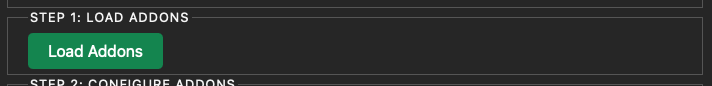
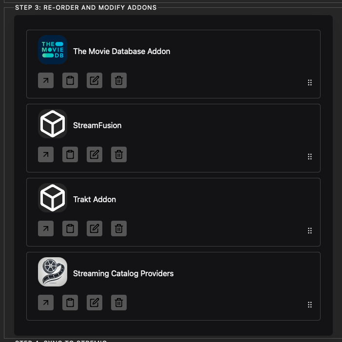
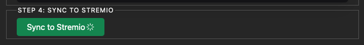

# Stremio Addon Manager Usage Guide

## Prerequisites

!!! important "Required addons"
    Before using the Stremio Addon Manager, make sure you have installed and configured the following addons on your Stremio account:

    * TMDB (official addon)
    * Stream-Fusion
    * Catalogs
    * Trakt

## Usage Steps

### Step 1: Connecting to the Manager

1. Go to your Stremio Addon Manager addon page.
2. Connect your Stremio account (Step 0 on the interface).

.png)

!!! tip "Tip"
    Make sure to use the same credentials as for your Stremio application.

### Step 2: Loading Addons

1. Click on "Load addons" (Step 1 on the interface).

!!! note "Note"
    This action will retrieve all add-ons installed on your Stremio account.

### Step 3: Unlocking and Configuration

1. In Step 2 of the interface, click on "Unlock Addons".
   * This unlocks the deletion of addons natively blocked by Stremio.
2. Still in Step 2, click on "Setup TMDB".
   * This action configures the official TMDB addon to manage metadata in Stremio, providing content in your preferred language.

.png)

!!! info "Information"
    The TMDB configuration is crucial for obtaining metadata in your preferred language in Stremio.

### Step 4: Customizing Addons

In Step 3 of the interface:
1. Configure the order of your addons.
   * The order will also influence the order of catalogs on the Stremio home page.
2. Use the advanced configuration to:
   * Rename catalogs
   * Remove unwanted catalogs from certain addons
   * Remove unwanted addons

!!! warning "Caution"
    Be careful when removing addons or catalogs. Some may be essential for the proper functioning of Stremio.

### Step 5: Synchronizing with Stremio

1. In Step 4, click on "Sync to Stremio".
   * This updates the changes made in the previous step.

## Finalization

!!! important "Restart Required"
    For the changes to take effect, completely restart your Stremio client.

## Troubleshooting

!!! tip "Issues with Metadata in Your Preferred Language"
    If you encounter problems with metadata in your preferred language:

    1. Verify that the official TMDB addon is properly installed on your account.
    2. Return to the Stremio Addon Manager.
    3. Click again on "Setup TMDB" in Step 2.

## Advanced Configuration

!!! note "Editing Manifests"
    The advanced configuration allows you to completely edit the manifest of addons. However, this feature is recommended only for users who have a good understanding of how Stremio addon manifests work.

!!! warning "Precaution"
    Incorrect editing of manifests can cause addon malfunctions. Proceed with caution and back up your configurations before making any significant changes.