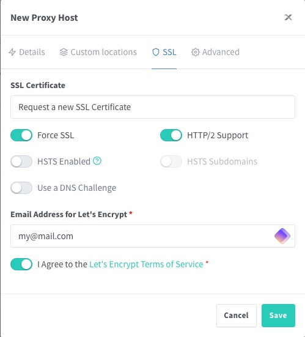

# Nginx Proxy Manager

This guide will walk you through setting up a reverse proxy for StreamFusion using Nginx Proxy Manager and Cloudflare for domain management.

## Domain Configuration with Cloudflare

Before configuring the reverse proxy, you need to set up your domain with Cloudflare.

!!! info "Cloudflare Documentation"
    For a detailed guide on configuring your domain with Cloudflare, please refer to the [official Cloudflare documentation](https://developers.cloudflare.com/fundamentals/get-started/setup/add-site/).

!!! warning "Patience"
    If you haven't configured your domain with Cloudflare yet, verifying domain ownership may take a few hours.

### Creating Subdomains

Once your domain is configured with Cloudflare, you need to create the necessary subdomains.

1. Get the public IP address of your VPS:
   ```bash
   curl ifconfig.me
   ```
   or
   ```bash
   wget -qO- http://ipecho.net/plain | xargs echo
   ```

2. In the Cloudflare dashboard, go to the "DNS" section.

    .png)

3. Create the following DNS records:

    #### A Record for the Root Domain

    | Type | Name | Content | Proxy status |
    |------|-----|---------|--------------|
    | A    | @   | [Your public IP address] | Proxied |

    #### CNAME Records for Subdomains

    | Type  | Name         | Content | Proxy status | Comment |
    |-------|--------------|---------|--------------|---------|
    | CNAME | proxy        | @       | Proxied      | Nginx Proxy Manager |
    | CNAME | streamfusion | @       | Proxied      | StreamFusion |
    | CNAME | jackett      | @       | Proxied      | Jackett (optional) |
    | CNAME | zilean       | @       | Proxied      | Zilean API (optional) |

    !!! warning "Cloudflare Proxy"
        Ensure the proxy status is activated (orange) for all your records to benefit from Cloudflare protection.

**Here's what your final DNS configuration should look like:**

.png)

## Installing Nginx Proxy Manager

### Creating the Directory for the Reverse Proxy

1. Connect to your VPS via SSH.
2. Create a new directory for Nginx Proxy Manager:
   ```bash
   mkdir nginx-proxy-manager && cd nginx-proxy-manager
   ```

### Configuring docker-compose.yml

Create a `docker-compose.yml` file in this directory:

```bash
nano docker-compose.yml
```

Copy and paste the following content:

```yaml
---
services:
  npm:
    image: 'jc21/nginx-proxy-manager:latest'
    restart: unless-stopped
    ports:
      - '80:80'
      - '81:81'
      - '443:443'
    volumes:
      - ./data:/data
      - ./letsencrypt:/etc/letsencrypt
    networks:
      - proxy_network

networks:
  proxy_network:
    external: true
```

!!! note "Docker Network"
    Make sure the `proxy_network` has been created previously as indicated in the StreamFusion installation guide.

### Launching Nginx Proxy Manager

Start Nginx Proxy Manager with the following command:

```bash
docker compose up -d
```

## Configuring Nginx Proxy Manager

### Accessing the Admin Interface

1. Open your browser and go to `http://<your_vps_ip>:81`

!!! tip "Port Opening"
    Make sure ports 80, 81, and 443 are open in your firewall.

2. Log in with the default credentials:
   - Email: `admin@example.com`
   - Password: `changeme`

!!! danger "Security"
    Change the password and email immediately after your first login!

### Creating Proxy Rules

We'll configure the proxy rules for Nginx Proxy Manager together as an example:

1. Click on **"Proxy Hosts"** then **"Add Proxy Host"**.

   .png)
   .png)

2. Fill in the fields:

    | Field | Value |
    |-------|-------|
    | Domain Names | Enter the full subdomain (e.g., `proxy.yourdomain.com`) |
    | Scheme | `http` (We're going through the Docker network) |
    | Forward Hostname / IP | Docker service name (e.g., `npm` for Nginx-Proxy-Manager) |
    | Forward Port | Service port (e.g., `81` for Nginx-Proxy-Manager) |

    .png)

3. In the "SSL" tab, select "Request a new SSL Certificate" and check "Force SSL".

    .png)

4. Enter your email and click "Save".

    

!!! tip "Docker Service Names"
    Make sure the service names in your StreamFusion `docker-compose.yml` match the Forward Hostname you use here.
    The same applies to ports; you'll find them in the expose section of your StreamFusion `docker-compose.yml`.

### Configuring Other Services

Here's a summary table of default information for other services:

| Host | Port |
|------|------|
| stream-fusion | 8080 |
| jackett | 9117 |
| zilean | 8181 |
| stremio-catalog-providers | 7000 |
| stremio-trakt-addon | 7000 |
| stremio-addon-manager | 80 |

## Verification and Testing

After configuring all your services:

1. Access your services via their respective subdomains (e.g., https://streamfusion.yourdomain.com).
2. Verify that the connection is secure (HTTPS) and that the SSL certificate is valid.

!!! success "Configuration Complete"
    Your reverse proxy is now configured and secured. Your services are accessible via HTTPS and protected by Cloudflare.

## Additional Security for Nginx Proxy Manager

Once you've completed the reverse proxy configuration and verified that everything works correctly, you can increase security by limiting direct access to the Nginx Proxy Manager admin interface.

### Modifying docker-compose.yml

1. Return to the Nginx Proxy Manager directory:
   ```bash
   cd ~/nginx-proxy-manager
   ```

2. Edit the `docker-compose.yml` file:
   ```bash
   nano docker-compose.yml
   ```

3. Comment out the line that exposes port 81:
   ```yaml
   services:
     npm:
       image: 'jc21/nginx-proxy-manager:latest'
       restart: unless-stopped
       ports:
         - '80:80'
         # - '81:81'  # Comment out this line
         - '443:443'
   ```

4. Save and close the file (Ctrl+X, then Y, then Enter).

### Restarting the Container

After modifying the file, restart the container to apply the changes:

```bash
docker compose up -d
```

!!! warning "Accessing the Admin Interface"
    After this modification, you will no longer be able to access the admin interface via `http://<your_vps_ip>:81`. You'll need to use the subdomain you configured (for example, `https://proxy.yourdomain.com`).

!!! tip "Enhanced Security"
    This additional step prevents direct access to the Nginx Proxy Manager admin interface from the outside, thus strengthening the security of your installation.

## Maintenance and Security

- Regularly check for Nginx Proxy Manager updates.
- Monitor logs for any suspicious activity.