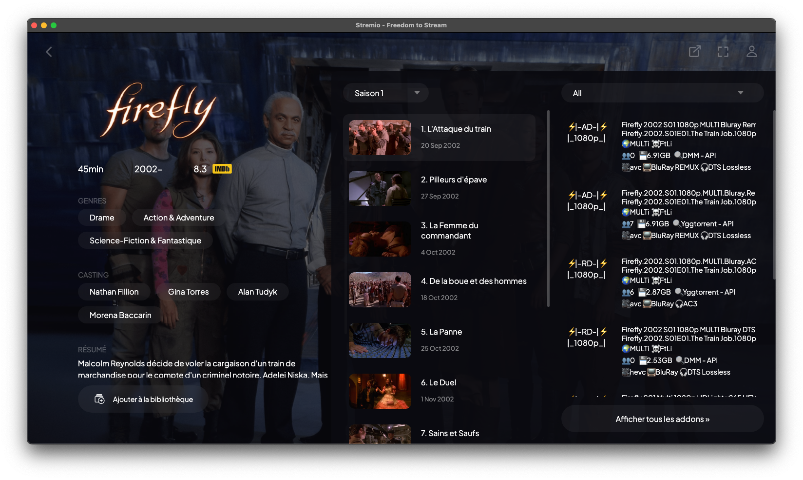
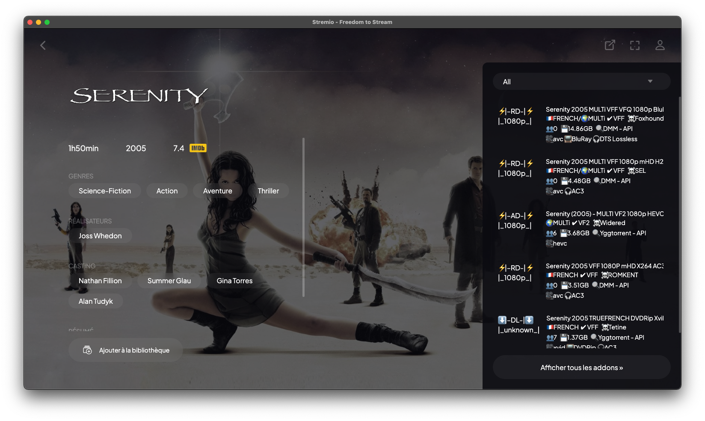

 

<h1 align="center">Introducing StreamFusion</h1>

StreamFusion is an advanced addon for Stremio, specially designed to enhance the streaming experience, with particular optimization for French-language content. Here are its main features:

- **Integration of French indexers**: Uses the main French indexers, either directly or via Jackett.
- **YggFlix catalog**: Integrates the YggFlix catalog directly into Stremio.
- **Zilean integration**: Indexes DébridMediaManager hashlists to access cached content from debridders.
- **Real-Debrid integration**: Allows direct redistribution of streaming links and torrent addition from Stremio.
- **AllDebrid integration**: Provides access to streaming links and torrents via AllDebrid.
- **TorBox integration**: Provides access to streaming links and torrents via TorBox.
- **Optimized sorting for French content**: Offers targeted and quality results, with language and team recognition.
- **Enhanced security**: Protects the application with an API key via a management interface.

StreamFusion aims to offer a smooth and comprehensive streaming experience, particularly tailored for French-speaking audiences, while integrating advanced features to improve the quality and diversity of content available on Stremio.

