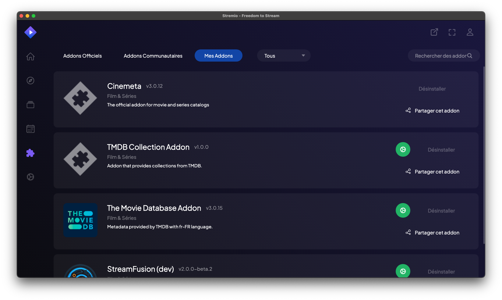

# The Stremio Addon System

Stremio uses an addon (or addon) system to extend its functionalities and provide content. These addons allow users to customize their experience by adding new content sources, additional features, and integrations with other services.

## Types of Stremio addons

Stremio supports several types of addons, each with a specific role:

### 1. Content addons
These addons provide content sources for movies, TV series, live channels, etc.
**Examples**:

- Torrentio (for public torrents)
- Netflix (official integration)
- StreamFusion (advanced addon for French-language content)

### 2. Metadata addons
They provide additional information about the content, such as descriptions, ratings, actors, etc.
**Examples**:

- Cinemata
- TMDB (The Movie Database)

### 3. Subtitle addons
These addons add subtitle sources for content.
**Examples**:

- OpenSubtitles
- Subscene

### 4. Catalog addons
They add new catalogs or content categories to Stremio.
**Examples**:

- Stremio-Addon-Catalogs (Supported by a French dev)
- Stremio-Addon-Sagas (for movie sagas)
- Anime Kitsu (for anime catalogs)

### 5. Utility addons
These addons add additional functionalities to Stremio.
**Examples**:

- Trakt (to track what you watch)
- DLNA (for streaming to other devices)

## How addons Work

Stremio addons function as web APIs. When a user searches for content or information, Stremio queries the installed addons to obtain relevant results. addons can be hosted locally or on remote servers.

## Installing addons

Installing addons in Stremio is simple and can be done in several ways:

1. **Via the official catalog**:
   - Open Stremio and click on the puzzle icon in the top right corner.
   - Browse available addons and click "Install" for those that interest you.

2. **Via a URL**:
   - If you have an addon URL, you can add it by clicking "Add addon" in the addons menu.
   - Paste the URL and click "Add".

3. **Via a local file**:
   - For locally developed addons, you can install them using their local URL (usually `http://localhost:PORT`).

## Addon Development

Developers can create their own Stremio addons using the official SDK. The process typically involves:

1. Using the Stremio SDK (available in JavaScript/Node.js).
2. Defining a manifest that describes the addon's capabilities.
3. Implementing handlers for various functionalities (streaming, metadata, etc.).
4. Deploying the addon on a publicly accessible server.

## Security and Legal Considerations

- Official addons are generally safe, but third-party addons may present risks.
- Some addons may provide access to copyrighted content. Users should be aware of the legal implications of using such addons.

## Conclusion

Stremio's addon system is what makes the application so versatile and popular. It allows users to access a wide range of content and features, while offering developers the opportunity to create and share their own extensions.