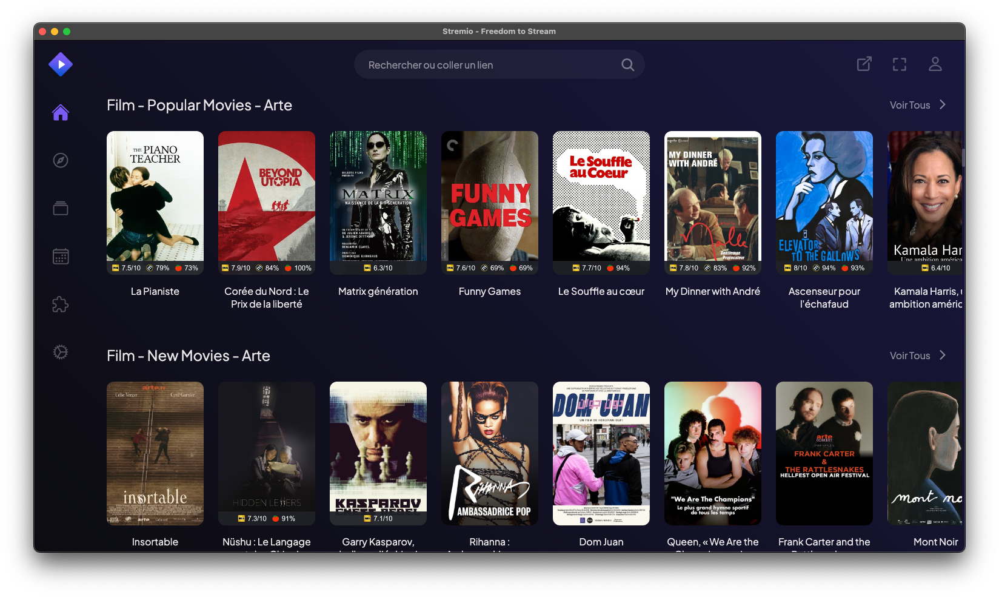

 

# What is Stremio?

Stremio is a modern multimedia streaming platform that allows users to watch movies, TV series, web channels, and much more. Its user-friendly interface and ability to centralize content from various sources make it a popular choice for online entertainment enthusiasts.

## Supported Platforms

Stremio is available on a wide range of platforms:

- Windows
- macOS
- Linux
- Android
- Android TV
- iOS (limited version)
- Samsung TV (2019+ models)
- LG TV (2020+ models)
- Sony TV (Android)
- Philips TV (Android)
- Steam Deck
- Web browsers

## Download

Here are the download links for the main platforms:

### Desktop Computers
- [Windows (Stremio 4.4)](https://www.stremio.com/downloads)
- [macOS (Stremio 4.4)](https://www.stremio.com/downloads)
- Linux:
  - [Flatpak](https://www.stremio.com/downloads)
  - [Debian/Ubuntu](https://www.stremio.com/downloads)
  - [Arch/Manjaro (AUR)](https://www.stremio.com/downloads)

### Mobile Devices and TV
- Android TV and Mobile:
  - [Stremio 1.6.12 ARM APK](https://www.stremio.com/downloads)
  - [Stremio 1.6.12 x86 APK](https://www.stremio.com/downloads)
  - [Stremio 1.6.12 ARM64 APK](https://www.stremio.com/downloads)
  - [Stremio 1.6.12 x86_64 APK](https://www.stremio.com/downloads)
- [iOS (App Store - limited version)](https://www.stremio.com/downloads)

### Other Platforms
- [Web browsers (Web App)](https://www.stremio.com/downloads)
- Samsung TV, LG TV, Sony TV, Philips TV: Available in their respective app stores
- Raspberry Pi: Stremio OS available for RPI4 and RPI5

## Recommendation

It is advised to use the latest available version of Stremio to benefit from the best performance and features.