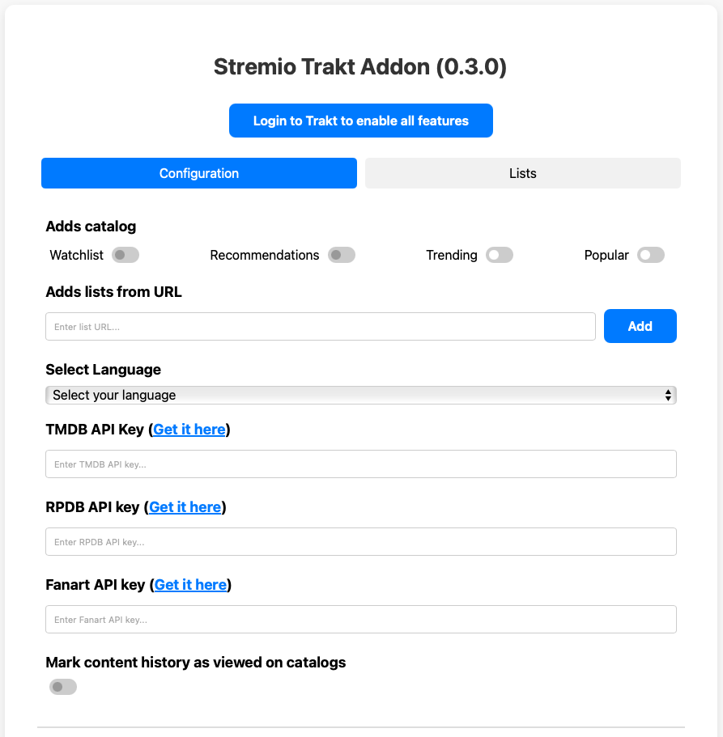

# Stremio Trakt Addon

## Description

Stremio Trakt Addon is a specialized addon for Stremio, offering deep integration with Trakt services to enhance your streaming experience. It provides personalized content and advanced customization options.

!!! info "Active Development"
    This addon is actively developed to ensure an optimal experience for Stremio and Trakt users.

## Key Features

### Content in Your Preferred Language

- Retrieves content in the language of your choice.

### Trakt Catalog Integration

- Access popular and trending catalogs from Trakt.
- View your watchlist and receive personalized recommendations from Trakt.

### List Management

- Add Trakt lists as catalogs by browsing through popular, trending, or search tabs on the addon configuration page.
- Add lists directly by Trakt URL.

### RPDB Integration

- Integrates RPDB, a web service providing posters and ratings for movies and series, enriching the visual and informational content of the catalogs.

### Fanart Integration

- Replaces titles with logos in the selected language (or English by default) to enhance visual appeal when available.

### Automatic Trakt History Sync

- Synchronizes your watch history with Stremio, ensuring your watched items are marked in your catalogs with a custom emoji of your choice.

### Automatic Token Refresh

- Avoid manual re-authentication thanks to an automatic token refresh system, maintaining access without interruptions.

### Mark Content as Watched

- Manually mark content as watched on Trakt directly from Stremio, with the option to rename or translate the action button text for better localization.

### Progressive Scraping (in development)

- Prefetch upcoming content pages as you scroll to improve loading times, ensuring smooth and reliable performance.

### Customizable Catalog Display

- Customize the order of catalogs through the addon's configuration page.

### Customizable Cache Management

- Adjust cache duration via environment variables to balance performance with content freshness.
- Set cache duration for RPDB posters, also adjustable via environment variables, to optimize API usage.

## Data Source

Catalog data is sourced from TMDB and Trakt, adhering to their Terms of Service. This product uses the TMDB & Trakt APIs but is not endorsed or certified by TMDB or Trakt.

## Acknowledgments

A big thank you to the developers of Stremio Trakt Addon for their hard work and dedication to improving the Stremio experience for the community. Your contribution is greatly appreciated!