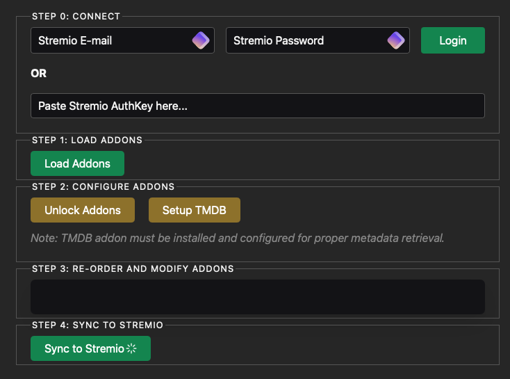

# Stremio Addon Manager



## Description

Stremio Addon Manager est un outil puissant conçu pour améliorer votre expérience Stremio en offrant des capacités de gestion avancées pour vos addons. Ce gestionnaire vous permet de réorganiser, supprimer et débloquer la suppression des addons d'un compte Stremio. Il offre également la possibilité de renommer les catalogues et d'éditer les manifestes des addons.

!!! info "Fonctionnalité clé"
    L'une des principales caractéristiques de cet outil est sa capacité à supprimer Cinemata, qui est normalement impossible à supprimer dans l'installation de base de Stremio. Cela vous permet de le remplacer par l'addon officiel TMDB, qui se chargera ensuite de fournir les métadonnées.

!!! tip "Astuce"
    Avec Cette addon, vous pouvez définir toutes les métadonnées en français, améliorant considérablement la localisation de votre expérience Stremio.

## Guide d'installation

Le processus d'installation du Stremio Addon Manager est simple. Suivez ces étapes pour le mettre en place :

### 1. Créer le répertoire d'installation

Tout d'abord, créez un nouveau répertoire pour le Stremio Addon Manager :

```bash
mkdir stremio-addon-manager
cd stremio-addon-manager
```

### 2. Créer le fichier Docker Compose

Dans le répertoire nouvellement créé, créez un fichier nommé `docker-compose.yml` et ajoutez-y le contenu suivant :

```yaml
---
networks:
  proxy_network:
    external: true

services:
  stremio-addon-manager:
    image: ghcr.io/limedrive/stremio-addon-manager:latest
    container_name: stremio-addon-manager
    expose:
      - 80
    restart: unless-stopped
    networks:
      - proxy_network
```

### 3. Lancer le conteneur

Pour démarrer le Stremio Addon Manager, exécutez la commande suivante dans le répertoire contenant votre fichier `docker-compose.yml` :

```bash
docker compose up -d
```

!!! note "Note"
    Cette commande téléchargera l'image nécessaire et démarrera le conteneur en mode détaché.

## Configuration HTTPS avec Nginx Proxy Manager

Pour sécuriser votre Stremio Addon Manager avec HTTPS, vous pouvez utiliser Nginx Proxy Manager. 

!!! info "Information"
    Les étapes détaillées pour ce processus sont couvertes dans une autre section de la documentation. En général, vous devrez :

    1. Accéder à votre tableau de bord Nginx Proxy Manager.
    2. Ajouter un nouveau Proxy Host.
    3. Le configurer pour pointer vers votre conteneur `stremio-addon-manager`.
    4. Configurer SSL pour le domaine.

!!! tip "Conseil"
    Référez-vous à la section Nginx Proxy Manager de la documentation de Stream-Fusion pour des instructions plus détaillées sur ce processus.

## Utilisation

Une fois installé et configuré, vous pouvez accéder au Stremio Addon Manager via votre navigateur web. Utilisez-le pour gérer vos addons Stremio, notamment pour :

- Réorganiser les addons
- Supprimer les addons (y compris ceux qui sont normalement non supprimables, comme Cinemata)
- Renommer les catalogues
- Éditer les manifestes des addons

!!! warning "Attention"
    N'oubliez pas d'utiliser cet outil avec précaution, en particulier lors de l'édition des manifestes ou de la suppression d'addons essentiels, afin d'assurer le bon fonctionnement continu de votre installation Stremio.

## Conclusion

Le Stremio Addon Manager est un outil précieux pour personnaliser et optimiser votre expérience Stremio. En suivant ce guide, vous devriez maintenant l'avoir installé et être prêt à l'utiliser. Profitez du contrôle accru sur vos addons Stremio !