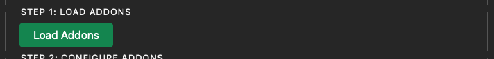
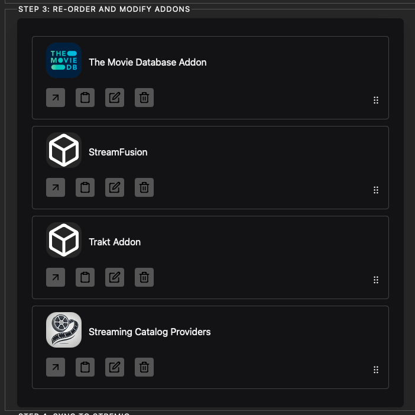
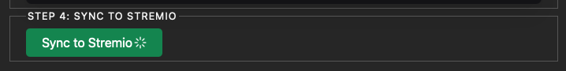

# Guide d'utilisation du Stremio Addon Manager

## Prérequis

!!! important "addons requis"
    Avant d'utiliser le Stremio Addon Manager, assurez-vous d'avoir installé et configuré les addons suivants sur votre compte Stremio :

    * TMDB (addon officiel)
    * Stream-Fusion
    * Catalogs
    * Trakt

## Étapes d'utilisation

### Étape 1 : Connexion au manager

1. Rendez-vous sur la page de votre addon Stremio Addon Manager.
2. Connectez votre compte Stremio (Step 0 sur l'interface).

.png)

!!! tip "Astuce"
    Assurez-vous d'utiliser les mêmes identifiants que pour votre application Stremio.

### Étape 2 : Chargement des add-ons

1. Cliquez sur "Load addons" (Step 1 sur l'interface).

!!! note "Note"
    Cette action va récupérer tous les add-ons installés sur votre compte Stremio.

### Étape 3 : Déverrouillage et configuration

1. Dans la Step 2 de l'interface, cliquez sur "Unlock Addons".
    * Cela débloque la suppression des addons nativement bloqués par Stremio.
2. Toujours dans la Step 2, cliquez sur "Setup TMDB".
    * Cette action configure l'addon officiel TMDB pour gérer les métadonnées dans Stremio, fournissant du contenu en français.

.png)

!!! info "Information"
    La configuration TMDB est cruciale pour obtenir des métadonnées en français dans Stremio.

### Étape 4 : Personnalisation des add-ons

Dans la Step 3 de l'interface :

1. Configurez l'ordre de vos addons.
    * L'ordre influencera également l'ordre des catalogues sur la page d'accueil de Stremio.
2. Utilisez la configuration avancée pour :
    * Renommer les catalogues
    * Supprimer les catalogues indésirables de certains addons
    * Supprimer les addons indésirables

!!! warning "Attention"
    Soyez prudent lors de la suppression d'addons ou de catalogues. Certains peuvent être essentiels au bon fonctionnement de Stremio.

### Étape 5 : Synchronisation avec Stremio

1. Dans la Step 4, cliquez sur "Sync to Stremio".
    * Cela met à jour les modifications effectuées dans l'étape précédente.

## Finalisation

!!! important "Redémarrage nécessaire"
    Pour que les modifications prennent effet, redémarrez complètement votre client Stremio.

## Résolution de problèmes

!!! tip "Problèmes de métadonnées en français"
    Si vous rencontrez des problèmes avec les métadonnées en français :
    
    1. Vérifiez que l'addon TMDB officiel est bien installé sur votre compte.
    2. Retournez sur le Stremio Addon Manager.
    3. Cliquez à nouveau sur "Setup TMDB" dans la Step 2.

## Configuration avancée

!!! note "Édition des manifestes"
    La configuration avancée permet d'éditer complètement le manifeste des addons. Cependant, cette fonctionnalité est recommandée uniquement pour les utilisateurs ayant une bonne compréhension du fonctionnement des manifestes d'addons Stremio.

!!! warning "Précaution"
    L'édition incorrecte des manifestes peut entraîner des dysfonctionnements des addons. Procédez avec prudence et sauvegardez vos configurations avant toute modification importante.