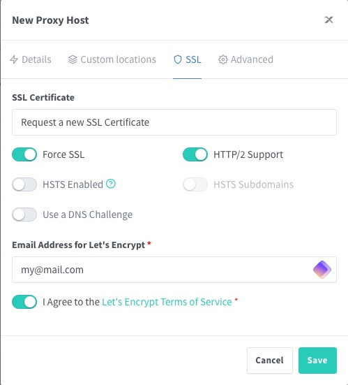

# Nginx Proxy Manager

Ce guide vous accompagnera dans la mise en place d'un reverse proxy pour StreamFusion en utilisant Nginx Proxy Manager et Cloudflare pour la gestion de domaine.

## Configuration du domaine avec Cloudflare

Avant de configurer le reverse proxy, vous devez configurer votre domaine avec Cloudflare.

!!! info "Documentation Cloudflare"
    Pour une guide détaillé sur la configuration de votre domaine chez Cloudflare, veuillez consulter la [documentation officielle de Cloudflare](https://developers.cloudflare.com/fundamentals/get-started/setup/add-site/).

!!! warning "Pacience"
    Si vous n'avez pas encore configuré votre domaine avec Cloudflare, la vérification de la propriété du domaine peut prendre quelques heures.


### Création des sous-domaines

Une fois votre domaine configuré chez Cloudflare, vous devez créer les sous-domaines nécessaires.

1. Obtenez l'adresse IP publique de votre VPS :
   ```bash
   curl ifconfig.me
   ```
   ou
   ```bash
   wget -qO- http://ipecho.net/plain | xargs echo
   ```

2. Dans le tableau de bord Cloudflare, allez dans la section "DNS".

    .png)

3. Créez les enregistrements DNS suivants :

    #### Enregistrement A pour le domaine racine

    | Type | Nom | Contenu | Proxy status |
    |------|-----|---------|--------------|
    | A    | @   | [Votre adresse IP publique] | Proxied |

    #### Enregistrements CNAME pour les sous-domaines

    | Type  | Nom          | Contenu | Proxy status | Commentaire |
    |-------|--------------|---------|--------------|-------------|
    | CNAME | proxy        | @       | Proxied      | Nginx Proxy Manager |
    | CNAME | streamfusion | @       | Proxied      | StreamFusion |
    | CNAME | jackett      | @       | Proxied      | Jackett ( optionel ) |
    | CNAME | zilean       | @       | Proxied      | Zilean API ( optionel ) |
    | CNAME | <service>    | @       | Proxied      | Autres services ( optionel ) |

    !!! warning "Proxy Cloudflare"
        Assurez-vous que le statut du proxy est activé (orange) pour tous vos enregistrements afin de bénéficier de la protection Cloudflare.

**Voici à quoi devrait ressembler votre configuration DNS final :**

.png)

## Installation de Nginx Proxy Manager

### Création du répertoire pour le reverse proxy

1. Connectez-vous à votre VPS via SSH.
2. Créez un nouveau répertoire pour Nginx Proxy Manager :
   ```bash
   mkdir nginx-proxy-manager && cd nginx-proxy-manager
   ```

### Configuration du docker-compose.yml

Créez un fichier `docker-compose.yml` dans ce répertoire :

```bash
nano docker-compose.yml
```

Copiez et collez le contenu suivant :

```yaml
---
services:
  npm:
    image: 'jc21/nginx-proxy-manager:latest'
    restart: unless-stopped
    ports:
      - '80:80'
      - '81:81'
      - '443:443'
    volumes:
      - ./data:/data
      - ./letsencrypt:/etc/letsencrypt
    networks:
      - proxy_network

networks:
  proxy_network:
    external: true
```

!!! note "Réseau Docker"
    Assurez-vous que le réseau `proxy_network` a été créé précédemment comme indiqué dans le guide d'installation de StreamFusion.

### Lancement de Nginx Proxy Manager

Démarrez Nginx Proxy Manager avec la commande suivante :

```bash
docker compose up -d
```

## Configuration de Nginx Proxy Manager

### Accès à l'interface d'administration

1. Ouvrez votre navigateur et accédez à `http://<votre_ip_vps>:81`

!!! tip "Ouverture des ports"
    Assurez-vous que les ports 80, 81 et 443 sont ouverts dans votre pare-feu.

2. Connectez-vous avec les identifiants par défaut :
   - Email : `admin@example.com`
   - Mot de passe : `changeme`

!!! danger "Sécurité"
    Changez immédiatement le mot de passe et l'email après votre première connexion !

### Création des règles de proxy

Nous allons configurer ensemble les règles de proxy pour Nginx Proxy Manager pour l'exemple:

1. Cliquez sur **"Proxy Hosts"** puis **"Add Proxy Host"**.

   .png)
   .png)

2. Remplissez les champs :

    | Champ | Valeur |
    |-------|--------|
    | Domain Names | Entrez le sous-domaine complet (ex: `proxy.votredomaine.com`) |
    | Scheme | `http` (Nous passons par le réseau Docker) |
    | Forward Hostname / IP | Nom du service Docker (ex: `npm` pour Nginx-Proxy-Manager) |
    | Forward Port | Port du service (ex: `81` pour Nginx-Proxy-Manager) |

    .png)

3. Dans l'onglet "SSL", sélectionnez "Request a new SSL Certificate" et cochez "Force SSL".

    .png)

4. Renseignez votre mail et Cliquez sur "Save".

    

!!! tip "Noms de services Docker"
    Assurez-vous que les noms de services dans votre `docker-compose.yml` de StreamFusion correspondent aux Forward Hostname que vous utilisez ici.
    Il en va de même pour les ports, vous les trouverez dans la partie expose de votre `docker-compose.yml` de streamfusion.

### Configuration des autres services

Voici un tableau récapitulatif des informations par défaut pour les autres services :

| Host | Port |
|------|------|
| stream-fusion | 8080 |
| jackett | 9117 |
| zilean | 8181 |
| stremio-catalog-providers | 7000 |
| stremio-trakt-addon | 7000 |
| stremio-addon-manager | 80 |

## Vérification et test

Après avoir configuré tous vos services :

1. Accédez à vos services via leurs sous-domaines respectifs (ex: https://streamfusion.votredomaine.com).
2. Vérifiez que la connexion est sécurisée (HTTPS) et que le certificat SSL est valide.

!!! success "Configuration terminée"
    Votre reverse proxy est maintenant configuré et sécurisé. Vos services sont accessibles via HTTPS et protégés par Cloudflare.

## Sécurisation supplémentaire de Nginx Proxy Manager

Une fois que vous avez terminé la configuration du reverse proxy et vérifié que tout fonctionne correctement, vous pouvez augmenter la sécurité en limitant l'accès direct à l'interface d'administration de Nginx Proxy Manager.

### Modification du docker-compose.yml

1. Revenez dans le répertoire de Nginx Proxy Manager :
   ```bash
   cd ~/nginx-proxy-manager
   ```

2. Éditez le fichier `docker-compose.yml` :
   ```bash
   nano docker-compose.yml
   ```

3. Commentez la ligne qui expose le port 81 :
   ```yaml
   services:
     npm:
       image: 'jc21/nginx-proxy-manager:latest'
       restart: unless-stopped
       ports:
         - '80:80'
         # - '81:81'  # Commentez cette ligne
         - '443:443'
   ```

4. Sauvegardez et fermez le fichier (Ctrl+X, puis Y, puis Enter).

### Redémarrage du conteneur

Après avoir modifié le fichier, redémarrez le conteneur pour appliquer les changements :

```bash
docker compose up -d
```

!!! warning "Accès à l'interface d'administration"
    Après cette modification, vous ne pourrez plus accéder à l'interface d'administration via `http://<votre_ip_vps>:81`. Vous devrez utiliser le sous-domaine que vous avez configuré (par exemple, `https://proxy.votredomaine.com`).

!!! tip "Sécurité renforcée"
    Cette étape supplémentaire empêche l'accès direct à l'interface d'administration de Nginx Proxy Manager depuis l'extérieur, renforçant ainsi la sécurité de votre installation.

## Maintenance et sécurité

- Vérifiez régulièrement les mises à jour de Nginx Proxy Manager.
- Surveillez les logs pour détecter toute activité suspecte.