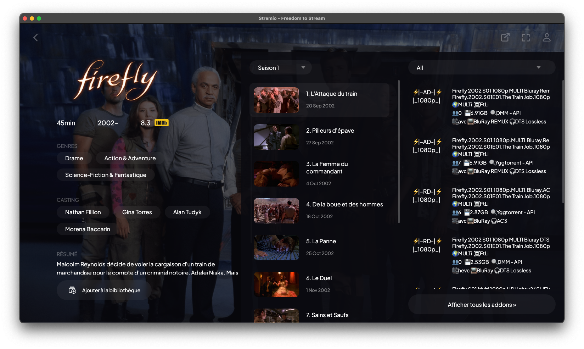
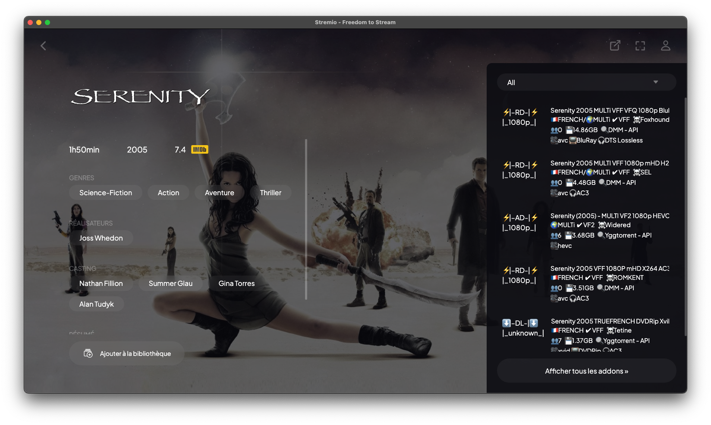

    

<h1 align="center">Présentation de StreamFusion</h1>

StreamFusion est un addon avancé pour Stremio, spécialement conçu pour améliorer l'expérience de streaming, avec une optimisation particulière pour le contenu francophone. Voici ses principales caractéristiques :

- **Intégration d'indexeurs français** : Utilise les principaux indexeurs français, directement ou via Jackett.
- **Catalogue YggFlix** : Intègre le catalogue YggFlix directement dans Stremio.
- **Intégration de Zilean** : Indexe les hashlist de DébridMediaManager pour accéder aux contenus en cache chez les débrideurs.
- **Intégration de Real-Debrid** : Permet la redistribution des liens de streaming en direct et l'ajout de torrents depuis Stremio.
- **Intégration de AllDebrid** : Offre un accès aux liens de streaming et aux torrents via AllDebrid.
- **Intégration de TorBox** : Offre un accès aux liens de streaming et aux torrents avec TorBox.
- **Tri optimisé pour le contenu français** : Offre des résultats ciblés et de qualité, avec reconnaissance des langues et des teams.
- **Sécurité renforcée** : Protège l'application avec une clé API via une interface de gestion.

StreamFusion vise à offrir une expérience de streaming fluide et complète, particulièrement adaptée au public francophone, tout en intégrant des fonctionnalités avancées pour améliorer la qualité et la diversité du contenu disponible sur Stremio.

