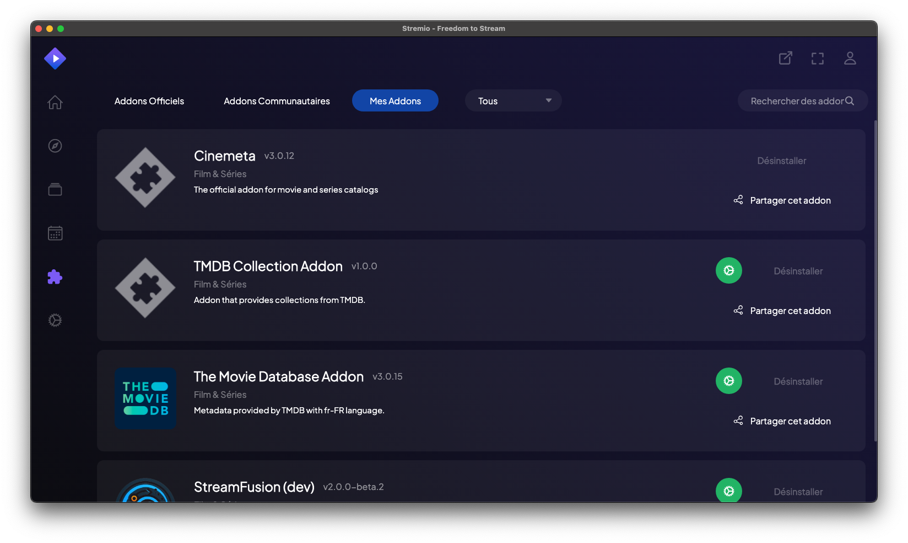

# Le système d'addons Stremio

Stremio utilise un système d'addons pour étendre ses fonctionnalités et fournir du contenu. Ces addons permettent aux utilisateurs de personnaliser leur expérience en ajoutant de nouvelles sources de contenu, des fonctionnalités supplémentaires et des intégrations avec d'autres services.

## Types d'addons Stremio

Stremio prend en charge plusieurs types d'addons, chacun ayant un rôle spécifique :

### 1. addons de contenu

Ces addons fournissent des sources de contenu pour les films, séries TV, chaînes en direct, etc.

**Exemples** : 

- Torrentio (pour les torrents publics)
- Netflix (intégration officielle)
- StreamFusion (addon avancé pour le contenu francophone)

### 2. addons de métadonnées

Ils fournissent des informations supplémentaires sur le contenu, comme les descriptions, les notes, les acteurs, etc.

**Exemples** :

- Cinemata
- TMDB (The Movie Database)

### 3. addons de sous-titres

Ces addons ajoutent des sources de sous-titres pour le contenu.

**Exemples** :

- OpenSubtitles
- Subscene

### 4. addons de catalogues

Ils ajoutent de nouveaux catalogues ou catégories de contenu à Stremio.

**Exemple** :

- Stremio-Addon-Catalogs (Supporté par un dev Français)
- Stremio-Addon-Sagas (pour les sagas de films)
- Anime Kitsu (pour les catalogues d'anime)

### 5. addons utilitaires

Ces addons ajoutent des fonctionnalités supplémentaires à Stremio.

**Exemples** :

- Trakt (pour suivre ce que vous regardez)
- DLNA (pour le streaming sur d'autres appareils)

## Fonctionnement des addons

Les addons Stremio fonctionnent comme des API web. Lorsqu'un utilisateur recherche du contenu ou des informations, Stremio interroge les addons installés pour obtenir les résultats pertinents. Les addons peuvent être hébergés localement ou sur des serveurs distants.

## Installation des addons

L'installation des addons dans Stremio est simple et peut se faire de plusieurs façons :

1. **Via le catalogue officiel** :

   - Ouvrez Stremio et cliquez sur l'icône de puzzle en haut à droite.
   - Parcourez les addons disponibles et cliquez sur "Installer" pour ceux qui vous intéressent.

2. **Via une URL** :

   - Si vous avez l'URL d'un addon, vous pouvez l'ajouter en cliquant sur "Ajouter un addon" dans le menu des addons.
   - Collez l'URL et cliquez sur "Ajouter".

3. **Via un fichier local** :

   - Pour les addons développés localement, vous pouvez les installer en utilisant leur URL locale (généralement `http://localhost:PORT`).

## Développement d'addons

Les développeurs peuvent créer leurs propres addons Stremio en utilisant le SDK officiel. Le processus implique généralement :

1. L'utilisation du SDK Stremio (disponible en JavaScript/Node.js).
2. La définition d'un manifeste qui décrit les capacités de l'addon.
3. L'implémentation des handlers pour les différentes fonctionnalités (streaming, métadonnées, etc.).
4. Le déploiement de l'addon sur un serveur accessible publiquement.

## Sécurité et considérations légales

- Les addons officiels sont généralement sûrs, mais les addons tiers peuvent présenter des risques.
- Certains addons peuvent donner accès à du contenu protégé par le droit d'auteur. Les utilisateurs doivent être conscients des implications légales de l'utilisation de tels addons.

## Conclusion

Le système d'addons de Stremio est ce qui rend l'application si polyvalente et populaire. Il permet aux utilisateurs d'accéder à une vaste gamme de contenus et de fonctionnalités, tout en offrant aux développeurs la possibilité de créer et de partager leurs propres extensions.