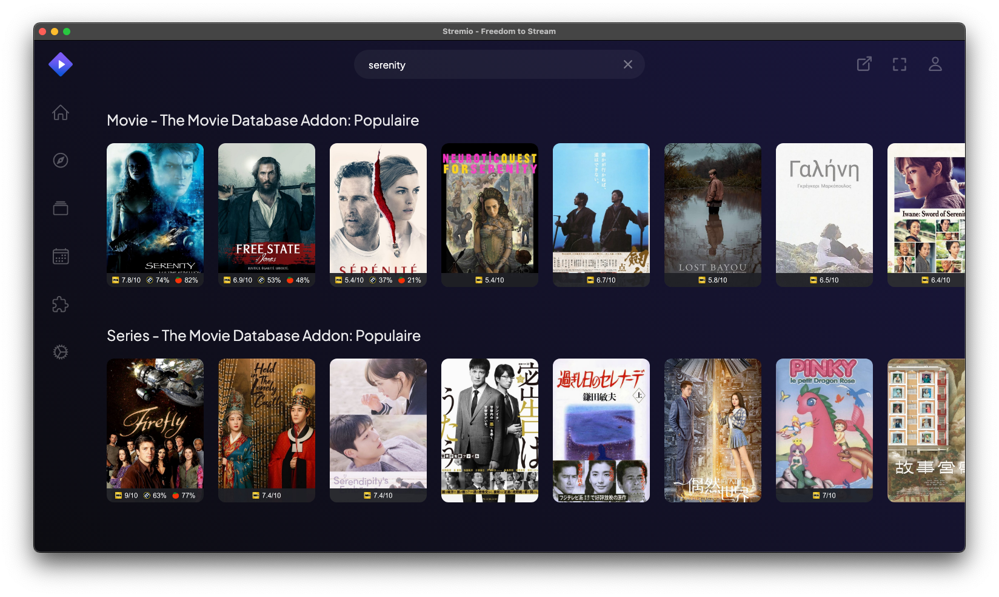
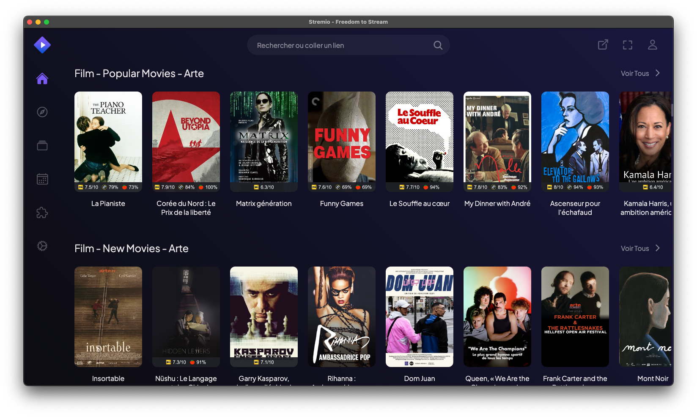

  

# Qu'est-ce que Stremio ?

Stremio est une plateforme de streaming multimédia moderne qui permet aux utilisateurs de regarder des films, des séries TV, des chaînes Web et bien plus encore. Son interface conviviale et sa capacité à centraliser du contenu provenant de diverses sources en font un choix populaire pour les amateurs de divertissement en ligne.

## Plateformes supportées

Stremio est disponible sur une large gamme de plateformes :

- Windows
- macOS
- Linux
- Android
- Android TV
- iOS (version limitée)
- Samsung TV (modèles 2019+)
- LG TV (modèles 2020+)
- Sony TV (Android)
- Philips TV (Android)
- Steam Deck
- Navigateurs web

## Téléchargement

Voici les liens de téléchargement pour les principales plateformes :

### Ordinateurs de bureau

- [Windows (Stremio 4.4)](https://www.stremio.com/downloads)
- [macOS (Stremio 4.4)](https://www.stremio.com/downloads)
- Linux :
  - [Flatpak](https://www.stremio.com/downloads)
  - [Debian/Ubuntu](https://www.stremio.com/downloads)
  - [Arch/Manjaro (AUR)](https://www.stremio.com/downloads)

### Appareils mobiles et TV

- Android TV et Mobile :
  - [Stremio 1.6.12 ARM APK](https://www.stremio.com/downloads)
  - [Stremio 1.6.12 x86 APK](https://www.stremio.com/downloads)
  - [Stremio 1.6.12 ARM64 APK](https://www.stremio.com/downloads)
  - [Stremio 1.6.12 x86_64 APK](https://www.stremio.com/downloads)
- [iOS (App Store - version limitée)](https://www.stremio.com/downloads)

### Autres plateformes

- [Navigateurs web (Web App)](https://www.stremio.com/downloads)
- Samsung TV, LG TV, Sony TV, Philips TV : Disponible dans leurs magasins d'applications respectifs
- Raspberry Pi : Stremio OS disponible pour RPI4 et RPI5

## Recommandation

Il est conseillé d'utiliser la dernière version disponible de Stremio pour bénéficier des meilleures performances et fonctionnalités.