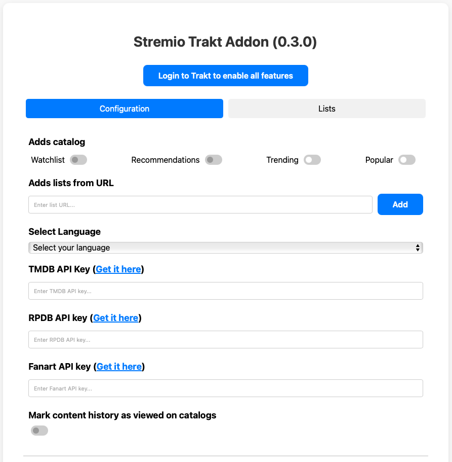

# Stremio Trakt Addon

## Description

Stremio Trakt Addon est un addon spécialisé pour Stremio, offrant une intégration profonde avec les services Trakt pour enrichir votre expérience de streaming. Il propose un contenu personnalisé et des options de personnalisation avancées.

!!! info "Développement actif"
    Cette addon est activement développé pour assurer une expérience optimale aux utilisateurs de Stremio et Trakt.

## Fonctionnalités clés

### Contenu dans votre langue préférée

- Récupère le contenu dans la langue de votre choix.

### Intégration des catalogues Trakt

- Accédez aux catalogues populaires et tendances de Trakt.
- Visualisez votre liste de surveillance et recevez des recommandations personnalisées de Trakt.

### Gestion des listes

- Ajoutez des listes Trakt comme catalogues en parcourant les onglets populaires, tendances ou de recherche sur la page de configuration de l'addon.
- Ajoutez directement des listes par URL Trakt.

### Intégration RPDB

- Intègre RPDB, un service web fournissant des affiches et des notes pour les films et séries, enrichissant le contenu visuel et informatif des catalogues.

### Intégration Fanart

- Remplace les titres par des logos dans la langue sélectionnée (ou en anglais par défaut) pour améliorer l'attrait visuel lorsque disponible.

### Synchronisation automatique de l'historique Trakt

- Synchronise votre historique de visionnage avec Stremio, assurant que vos éléments visionnés sont marqués dans vos catalogues avec un emoji personnalisable.

### Actualisation automatique du token

- Évitez la ré-authentification manuelle grâce à un système d'actualisation automatique du token, maintenant l'accès sans interruptions.

### Marquer le contenu comme visionné

- Marquez manuellement le contenu comme visionné sur Trakt directement depuis Stremio, avec la possibilité de renommer ou traduire le texte du bouton d'action pour une meilleure localisation.

### Scraping progressif (en développement)

- Préchargez les pages de contenu à venir pendant le défilement pour améliorer les temps de chargement, assurant des performances fluides et fiables.

### Affichage personnalisable des catalogues

- Personnalisez l'ordre des catalogues via la page de configuration de l'addon.

### Gestion de cache personnalisable

- Ajustez la durée du cache via des variables d'environnement pour équilibrer performance et fraîcheur du contenu.
- Définissez la durée du cache pour les affiches RPDB, également ajustable via des variables d'environnement, pour optimiser l'utilisation de l'API.

## Source des données

Les données des catalogues proviennent de TMDB et Trakt, conformément à leurs conditions d'utilisation. Ce produit utilise les API TMDB et Trakt mais n'est ni approuvé ni certifié par TMDB ou Trakt.

## Remerciements

Un grand merci aux développeurs de Stremio Trakt Addon pour leur travail acharné et leur dévouement à améliorer l'expérience Stremio pour la communauté. Votre contribution est grandement appréciée !